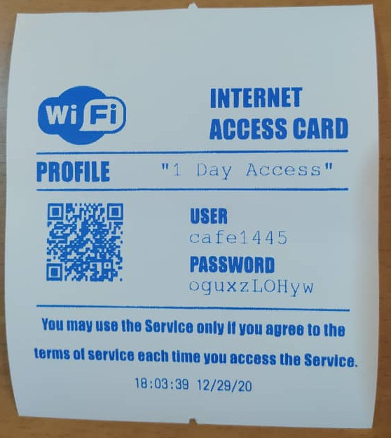

# vougenpi
The Raspberry Pi script to generate and print vouchers for hotspot access using Mikrotik routers 

Vougenpi can be used in two different operations : directly key mode , file mode

If enable ( start ) gpiobutton.service , you can generate the voucher by press the key.

Default pin is 21 and you can change it on /home/pi/vougen.conf

Also vougen.path service is for to monitor /opt/vougen/inbox/new.txt and you can change this file

for to generate the voucher . The format for this file is           issuer,receiver,profile,print

I used this format for to send the command from Asterisk VOIP server for to create the voucher by reception

for the rooms in the Hotel . Here reception is issure and Rooms are receivers .

For directly key mode there is default number for issuer and receiver and you can change it on gpiorder.conf

All the details of vouchers will be record on the vougen database , vouchers table by mariadb server.

THIS GUIDE WILL BE UPDATED AS SOON AS POSSIBLE

## System requirements
### Hardware
Vougenpi requires

Raspberry Pi card

Mikrotik router

ESC/POS Printer

### Software

last Raspberry Pi OS (Lite version is recommended)

Mariadb

 The command-line utility to create a QR code

 Python library to manipulate ESC/POS Printers

## Configuration RouterOS SSH
Vougenpi requires RouterOS SSH public/private key login 

)

## Installation 
Get the latest.tar.gz release and extract it. Then run:

tar -xzvf latest.tar.gz

cd latest

sudo ./vougensetup.sh

